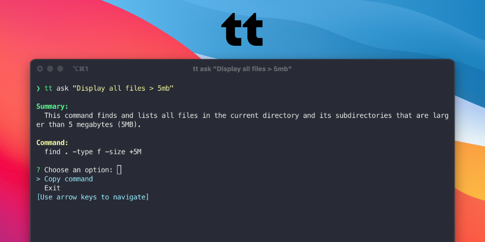

## About
tt is an AI-powered CLI tool inspired by GitHub Copilot CLI.
Unlike Copilot, it doesn’t require a GitHub license — just plug in your own API key (e.g., OpenAI) and you’re ready to go.

Type natural language commands and let tt suggest and execute the appropriate terminal commands for your system.

## Install
### Windows (PowerShell)
```
irm https://raw.githubusercontent.com/dunward/tt/master/install.ps1 | iex
```

## Quick Guide
To get started, configure your OpenAI API key:
```
tt config open-ai "your-api-key"
```
Once configured, you can ask natural language questions and receive command suggestions using:
```
tt ask "your query"
```

### Usage Example
```
tt ask "print all .png files in this directory"

Summary:
  The command lists all files with the .png extension in the current directory.

Command:
  Get-ChildItem -Filter *.png

? Choose an option:
> Copy command
  Exit
[Use arrow keys to navigate]
```
